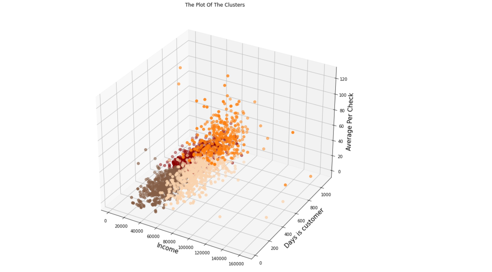

## Introduction and Objective ##
* In this project, I apply my knowledge of Python programming skills to guide you through typical stages of customer segmentation tasks.
* I highly recommend that you download CustomerSegmentation.html and open it in a browser for easy viewing, it already includes table of content
* If you want to read directly or modify and run step by step, just click or download CustomerSegmentation.ipynb and you are good to go

## Skills Acquired ##
Some Excel skills that I acquired and used after finished the project
1. Power Query and Power Pivot (I never realized that how easy and powerful they are for data cleaning and transforming)
2. Data model and pivot table
3. Dynamic named ranged and data source for chart
4. How to build clean, interactive Dashboard that has filters for reporting and visualizing

