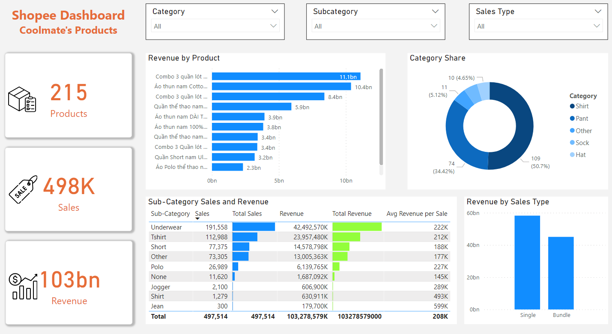

## Problem ##
* If you are learning Data Science, you might encounter this problem as I do at some point. You have acquired your skills to become data analyst/scientist/engineer, you feel excited and ready to apply your knowledge into a real-world project. You search for a dataset that fit your idea but you can't find it, even if you've gone to every online public platform like Kaggle, data-worldbank,... .
* The truth hurts but then you have to accept and realize that if you want to find a unique dataset for your project, you can't rely entirely on public platforms. No need to worry about, I will show you how I scrape my own dataset using Scrapy library in this project.

## Introduction and Objective ##
* We will learn how to scrap a dataset of products's information from Shopee (an Ecommerce platform) using Selenium and BeautifulSoup , how to clean and make use of that data to extract more useful features. Furthermore, we're going to get our hands dirty in Power BI by creating a product dashboard
* The project includes 2 parts: Data Scrapping and Power BI dashboard. You can jump straight to dashboard if you just want to see some visualizations and don't care about technical parts.
* a Shopee store that we scrape today is Coolmate. It is a minimalistic fashion brand which's been popular in Vietnam recently because their fashion aims specifally for young men who value comfort and ease over fashionable clothes. 
* You can change URL in Scrapy to scrape any Shopee store that you like

## Skills Acquired ##
1. Power Query and Power Pivot
2. Basic charts in Power BI
3. How to build clean, interactive Dashboard that has filters for reporting and visualizing

